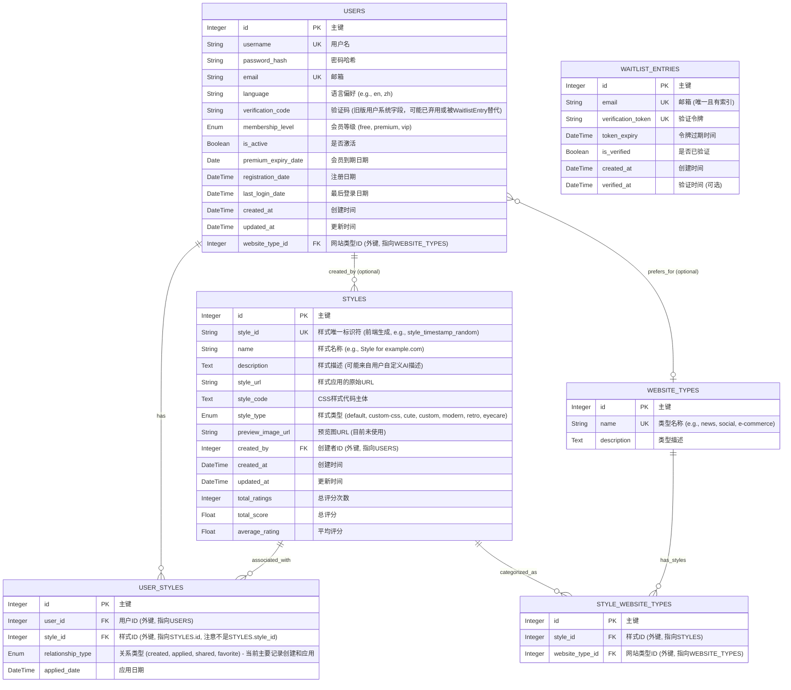

# StyleSwift 项目实体关系图 (ERD)

```mermaid
erDiagram
    USERS {
        Integer id PK "主键"
        String username UK "用户名"
        String password_hash "密码哈希"
        String email UK "邮箱"
        String language "语言偏好 (e.g., en, zh)"
        String verification_code "验证码 (旧版用户系统字段，可能已弃用或被WaitlistEntry替代)"
        Enum membership_level "会员等级 (free, premium, vip)"
        Boolean is_active "是否激活"
        Date premium_expiry_date "会员到期日期"
        DateTime registration_date "注册日期"
        DateTime last_login_date "最后登录日期"
        DateTime created_at "创建时间"
        DateTime updated_at "更新时间"
        Integer website_type_id FK "网站类型ID (外键, 指向WEBSITE_TYPES)"
    }

    WAITLIST_ENTRIES {
        Integer id PK "主键"
        String email UK "邮箱 (唯一且有索引)"
        String verification_token UK "验证令牌"
        DateTime token_expiry "令牌过期时间"
        Boolean is_verified "是否已验证"
        DateTime created_at "创建时间"
        DateTime verified_at "验证时间 (可选)"
    }

    STYLES {
        Integer id PK "主键"
        String style_id UK "样式唯一标识符 (前端生成, e.g., style_timestamp_random)"
        String name "样式名称 (e.g., Style for example.com)"
        Text description "样式描述 (可能来自用户自定义AI描述)"
        String style_url "样式应用的原始URL"
        Text style_code "CSS样式代码主体"
        Enum style_type "样式类型 (default, custom-css, cute, custom, modern, retro, eyecare)"
        String preview_image_url "预览图URL (目前未使用)"
        Integer created_by FK "创建者ID (外键, 指向USERS)"
        DateTime created_at "创建时间"
        DateTime updated_at "更新时间"
        Integer total_ratings "总评分次数"
        Float total_score "总评分"
        Float average_rating "平均评分"
    }

    USER_STYLES {
        Integer id PK "主键"
        Integer user_id FK "用户ID (外键, 指向USERS)"
        Integer style_id FK "样式ID (外键, 指向STYLES.id, 注意不是STYLES.style_id)"
        Enum relationship_type "关系类型 (created, applied, shared, favorite) - 当前主要记录创建和应用"
        DateTime applied_date "应用日期"
    }

    WEBSITE_TYPES {
        Integer id PK "主键"
        String name UK "类型名称 (e.g., news, social, e-commerce)"
        Text description "类型描述"
    }

    STYLE_WEBSITE_TYPES {
        Integer id PK "主键"
        Integer style_id FK "样式ID (外键, 指向STYLES)"
        Integer website_type_id FK "网站类型ID (外键, 指向WEBSITE_TYPES)"
    }

    USERS ||--o{ USER_STYLES : "has"
    STYLES ||--o{ USER_STYLES : "associated_with"
    USERS }o--o| WEBSITE_TYPES : "prefers_for (optional)"
    STYLES ||--o{ STYLE_WEBSITE_TYPES : "categorized_as"
    WEBSITE_TYPES ||--o{ STYLE_WEBSITE_TYPES : "has_styles"
    USERS ||--o{ STYLES : "created_by (optional)"

    %% 等候名单与用户是分离的，但邮箱可能最终成为用户邮箱
    %% WAITLIST_ENTRIES }o--o{ USERS : "may_become (implicit via email)"

    %% 注释:
    %% - PK: Primary Key (主键)
    %% - UK: Unique Key (唯一键)
    %% - FK: Foreign Key (外键)
    %% - IX: Index (索引) - 注意：IX不直接在Mermaid属性行中声明，此处注释说明email字段应有索引
    %% - USER_STYLES.style_id 应该是指向 STYLES 表的数字主键 id，而不是字符串的 style_id。
    %% - verification_code 在 USERS 表中，可能与新的 WAITLIST_ENTRIES 中的验证流程有重叠或已逐步被替代。
    %% - created_by 在 STYLES 表中，用于追踪是哪个用户创建的样式（如果系统支持用户创建并保存到公共库）。
    %% - 关系 USER_STYLES 表当前主要隐含了用户"应用"了某个样式（通过前端的 chrome.storage.local 行为），
    %%   或后端在生成样式时隐式创建。
    %%   "created"关系可能指用户通过自定义CSS保存的样式，或未来用户可将AI生成的样式明确保存为"我的创作"。
    %%   "shared"和"favorite"是未来扩展方向。
```